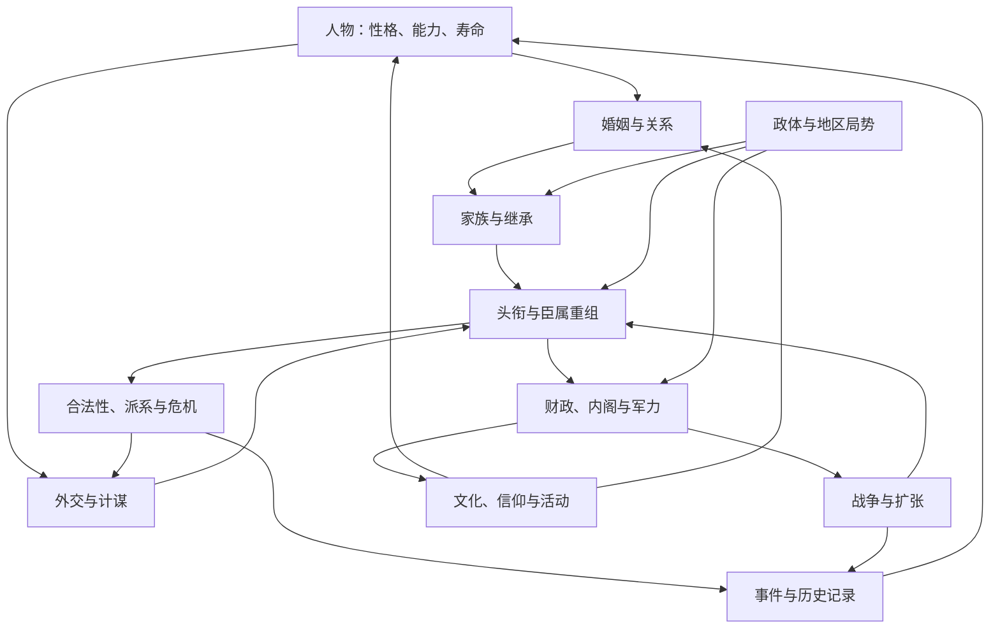

# 设计总纲与系统地图

[返回总览](README.md) · [版本边界](01-version-and-dlc.md) · [联动案例](02-system-interactions.md) · [制作建议](03-production-and-prototype.md)

## 1. 核心体验

CK3 将角色扮演和大战略组合起来：人物拥有性格、关系、家族归属与头衔，权力随婚姻、继承和战争不断变化。当前版本还允许在相应 DLC 下经营无地营地或家族宅邸，所以“有领土的统治者”已经不能涵盖全部可玩身份。[^1]

**设计判断：玩家持续管理的是一条跨世代的命运线。** 当前角色拥有有限寿命、具体能力和私人欲望；家族希望延续地位；领地与制度又有各自的稳定要求。三者的利益错位，使“这一代最划算的事”和“下一代最好接手的局面”产生冲突。

例如，多生子女能提供更多婚盟与继承备份，但在分割继承下也可能增加权力分散。具体效果依继承法和婚姻归属而变；这是同一行为跨多个时间尺度产生不同价值的典型例子。[^2]

## 2. 四层循环

| 层次 | 玩家反复进行的行为 | 反馈与重置 |
| --- | --- | --- |
| 即时决策 | 查看人物和局势 → 选择互动、事件选项或调动 | 获得资源、关系变化、秘密和即时风险 |
| 经营循环 | 投资 → 建立军力或人脉 → 争夺资源与权力 → 消化成果 | 获得更大能力，同时承担更多治理成本 |
| 人生循环 | 教育与成长 → 建功与经营 → 安排接班 → 衰老和死亡 | 个人能力、关系和职务重新组合 |
| 世代循环 | 家族扩张 → 传承积累 → 制度调整 → 新一代追求不同目标 | 家族积累保留，局部权力关系重组 |

这四层是分析用的抽象，不是游戏内四个官方模式。节奏以游戏时间表达：一次点击改变状态，持续项目按阶段推进，战争和人生活动交错，继承将长期准备集中结算。

## 3. 模块之间的主干关系

[联动案例](02-system-interactions.md)把这里的箭头展开为具体行动链。图中的“事件”不是独立故事区：它既读取其他系统产生的事实，也会将结果写回其他系统。

## 4. 拆分模块的依据

不按菜单数量拆，也不把每个 DLC 当成一个封闭系统。划分时依次问：谁持有状态，玩家操作什么，结果写给谁。

| 状态归属 | 典型状态 | 主责模块 |
| --- | --- | --- |
| 人物 | 特质、压力、健康、技能 | [01](modules/01-character.md)、[02](modules/02-education-lifestyle.md) |
| 关系 | 婚姻、友情、敌意、秘密的知情者、牵制 | [03](modules/03-marriage-family.md)、[06](modules/06-diplomacy.md)、[07](modules/07-secrets-hooks-prisoners.md) |
| 家族 | 宗族传承、支系、家族关系 | [04](modules/04-dynasty.md) |
| 权利和制度 | 头衔、宣称、继承法、臣属契约 | [05](modules/05-succession.md)、[09](modules/09-titles-claims.md)、[10](modules/10-subjects-factions.md)、[11](modules/11-laws-legitimacy.md) |
| 地点 | 地形、地产、文化、信仰、发展、控制 | [14](modules/14-economy.md)—[17](modules/17-faith.md) |
| 进行中的行动 | 计谋、战争、旅行、活动 | [08](modules/08-schemes.md)、[18](modules/18-war.md)—[20](modules/20-activities-travel.md) |
| 群体局势 | 参与资格、阶段、推动条件、结束条件 | [24](modules/24-disasters.md)、[29](modules/29-china.md)、[32](modules/32-situations.md) |

政体是上述规则的组合与替换，不只是一个加成标签。例如行政制把“家族拥有的宅邸”与“角色任职的省份”区分开；游牧用牧群、肥力与迁徙改变收入和军力的形成方式。[^3]

## 5. 最重要的七个设计点

1. **同一个人物承担多种身份。** 配偶、继承人、盟友、主教和仇人可以重叠，因此新增一条关系可能同时影响多个系统。
2. **性格给最优策略增加约束。** 压力使角色扮演有实际成本，但仍保留违背性格的选择。[见 01](modules/01-character.md)
3. **继承制造可准备的波动。** 玩家知道要接班，却不能无成本保留上一代全部优势。[见 05](modules/05-succession.md)
4. **权利与实力分开。** 拥有军队，不等于拥有任意夺地的合法战争目标。[见 09](modules/09-titles-claims.md)
5. **扩张会产生新的代理问题。** 授权可以增加管理范围，也会养成能够反对自己的权力中心。[见 10](modules/10-subjects-factions.md)
6. **内容复用依靠已有世界事实。** 同一模板让不同的人物承担参与者身份，就能衍生不同后果；这需要关系和历史真正进入条件。[见 22](modules/22-events-stories.md)
7. **改变制度就是改变解题方式。** 文化、信仰和政体能够修改行动资格、资源来源与继承结构。[见 16](modules/16-culture.md)、[17](modules/17-faith.md)、[25](modules/25-core-governments.md)

以上是设计分析，不等于已验证的玩家心理实验，也不应一概解释为开发者公开表达过的意图。

## 6. 反馈、难度与可重复游玩

正反馈包括财政支持军力、军力获得土地、土地扩大财政，以及家族地位改善婚姻机会。相应约束包括直辖与封臣容量、继承分割、派系、文化信仰差异和战争耗损。灾害能扰动局势，但不是根据玩家领先程度精准匹配的平衡器。[^1][^2]

这些约束并不保证永远平衡：熟练玩家可能利用兵种加成、婚姻安排和制度转换持续扩大优势。因此学习重点应是“制造多目标取舍的方法”，而不是默认每个 CK3 子系统都值得照搬。

重复游玩来自起始角色、地理位置、家族关系、性格、政体和局势的组合。内容量仍然重要，但小型项目更应先确认少量规则能否产生不同故事，再扩大历史数据库。

## 7. 本套文档的完整性边界

覆盖独立决策系统、关键子机制及主要扩展如何改写循环。命名和英文术语用于查阅原资料，不保证全部对应当前简体中文本地化的唯一用词。

不逐条收录数百个传统、特质、战争理由、建筑、决议或事件 ID；同一规则下的内容变体用代表性例子说明。艺术、音效与界面主要从识别人物、表达地位、提示风险和管理复杂度的功能拆解，集中在 [21](modules/21-royal-court-artifacts.md) 和 [33](modules/33-time-information-ai.md)。

本套文档没有通过本地 CK3 实机逐一重现所有机制。具体数值、罕见资格组合、DLC 交叉条件应回到当前游戏提示与版本资料验证。

## 来源

[^1]: Paradox Community Wiki，[Government](https://ck3.paradoxwikis.com/Government)、[Character](https://ck3.paradoxwikis.com/Characters)，访问 2026-09-13；Government 标注 PC 1.19。
[^2]: Paradox Community Wiki，[Family (relation)](https://ck3.paradoxwikis.com/Marriage)、[Succession laws](https://ck3.paradoxwikis.com/Succession_laws)，访问 2026-09-13。
[^3]: Paradox Community Wiki，[Administrative](https://ck3.paradoxwikis.com/Administrative)、[Nomadic](https://ck3.paradoxwikis.com/Nomadic)，访问 2026-09-13，标注 PC 1.19。

