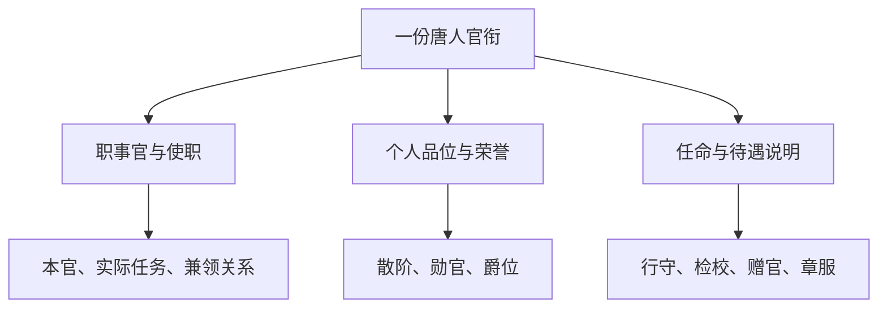

# 官职头衔的基本结构

[首页](README.md) · [官名索引](04-官名总索引.md) · [年代](02-制度沿革年代总表.md) · [史料](91-史料分卷导航.md)

唐人一长串官衔可以同时表达身份等级、实际职务、奉命任务、功劳、爵位与待遇。这些信息能够叠加，不能排成一张互相取代的“官职升级表”。[^J42]

| 类别 | 主要回答的问题 | 例子 | 阅读入口 |
| --- | --- | --- | --- |
| 职事官 | 在法定官署中担任何种职务 | 中书舍人、县令、左卫大将军 | [中央文官](10-中央文官总览.md)、[中央武官](40-中央武官总览.md)、[地方](50-地方官制总览.md) |
| 使职 | 受委任办理什么事务 | 节度使、盐铁转运使、知制诰 | [财政使职](39-财政使职.md)、[幕府](57-使府幕职.md) |
| 散官／散阶 | 个人在官僚等级体系中的品位 | 朝散大夫、游击将军 | [文散官](70-文散官.md)、[武散官](71-武散官.md) |
| 勋官 | 所获勋劳等级 | 上柱国、骑都尉 | [十二转勋官](72-勋官.md) |
| 爵位 | 受封的政治身份 | 国公、开国县伯 | [爵位](73-爵位.md) |
| 附加语 | 任命方式、褒奖或特殊待遇 | 检校、行、守、赐紫金鱼袋 | [附加头衔](75-加衔赠官与章服.md) |

## 三个容易误判的地方

**文官、武官须按制度身份和实际工作两面判断。**兵部是文官机构，府州的兵曹参军也通常归文职；都督、都护具有军事职掌，《旧唐书》某些品表却将其列在文职事官中。诸卫内部也有文职长史、录事及曹官。本编按机构分区，同时在相关页注明性质交叉。

**散官不等于任何“没有实权的官”。**散骑常侍虽有“散骑”二字，在唐代一定阶段是谏诤侍从职事官；中晚唐的检校尚书又可能充作荣衔。名称相似不能替代制度分类。

**“无独立品秩”不等于地位低。**同中书门下平章事、翰林学士、节度使等通常依所带本官、散阶确定品位。实际决策能力要结合委任范围、接近皇帝程度、所掌财政军队来判断。赖瑞和《唐代高层文官》公开导言用此思路解释本官与使职；这里采用这一分析视角，不把其所有理论推演一并视作定论。参见[现代研究书目](90-史料与现代研究书目.md)。

## 依据与版本

下列卷次是核对入口；多源并列不表示对所有品额一致。异文参见[校核记录](81-异文与争议校核.md)。

[^D02]: 唐六典·卷02。唐玄宗敕修，李林甫等奉敕注，开元十年至二十七年（722—739）纂修。[在线文本](https://zh.wikisource.org/wiki/唐六典/卷02)；[本包工作摘录](史料/D02-唐六典-卷02.md)。

[^D05]: 唐六典·卷05。唐玄宗敕修，李林甫等奉敕注，开元十年至二十七年（722—739）纂修。[在线文本](https://zh.wikisource.org/wiki/唐六典/卷05)；[本包工作摘录](史料/D05-唐六典-卷05.md)。

[^J42]: 舊唐書·卷42。后晋刘昫等署衔修撰，后晋开运二年（945）成书。[在线文本](https://zh.wikisource.org/wiki/舊唐書/卷42)；[本包工作摘录](史料/J42-舊唐書-卷42.md)。

[^N046]: 新唐書·卷046。北宋欧阳修、宋祁等修撰，北宋嘉祐五年（1060）成书。[在线文本](https://zh.wikisource.org/wiki/新唐書/卷046)；[本包工作摘录](史料/N046-新唐書-卷046.md)。

[^T019]: 通典·卷019。唐杜佑，唐德宗贞元十七年（801）进书。[在线文本](https://zh.wikisource.org/wiki/通典/卷019)；[本包工作摘录](史料/T019-通典-卷019.md)。
